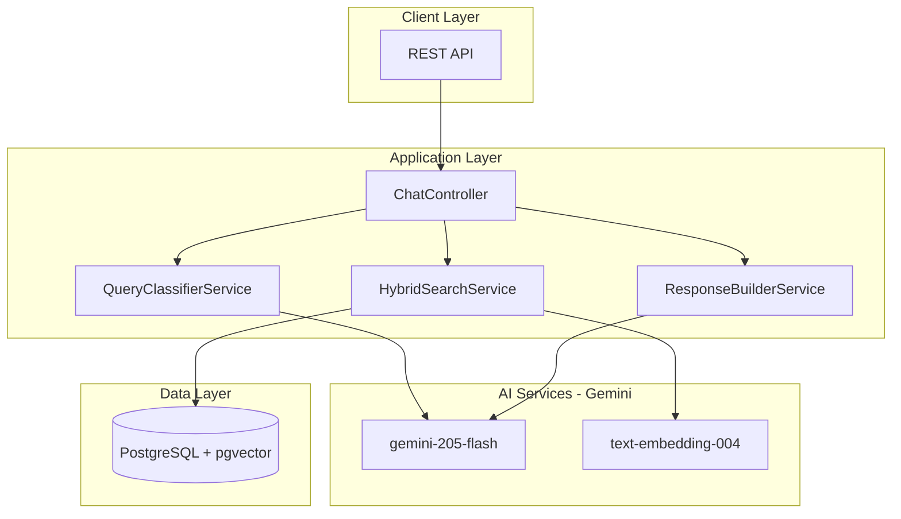

# SmartCatalog - AI-Powered Product Search (Portfolio Demo)

[](https://github.com/pablojacobi/smart-catalog/actions/workflows/ci.yml)
[](https://www.ruby-lang.org/)
[](https://rubyonrails.org/)
[](coverage/)
[](LICENSE)

A simplified Rails 8 application demonstrating enterprise AI patterns: RAG with pgvector, hybrid search, and LLM query classification. **Runs 100% locally with Ollama** (free) or with Google Gemini (cloud).

> **Note**: This is a **simplified portfolio version** of a production system. See [Features Not Included](#features-not-included-in-this-demo) for the full list of capabilities available in the complete implementation.

## Overview

SmartCatalog showcases modern AI engineering practices:

- **Hybrid Search**: Combines semantic vector search (pgvector) with structured SQL filters
- **LLM Query Classification**: Gemini classifies queries to optimize response strategy
- **Cost Optimization**: Direct DB responses for simple queries ($0), LLM only when needed
- **Enterprise Patterns**: Service objects, result objects, query objects, blueprinter serializers

## Architecture Overview



## Tech Stack

| Component | Technology |
|-----------|------------|
| Framework | Rails 8.1 (API mode) |
| Database | PostgreSQL 16 + pgvector |
| LLM | **Ollama** (local, free) or Google Gemini (cloud) |
| Chat Model | llama3.2 (local) / gemini-2.0-flash (cloud) |
| Embeddings | nomic-embed-text (local) / text-embedding-004 (cloud) |
| Testing | RSpec + FactoryBot + WebMock |
| Container | Docker + Docker Compose |

## Quick Start

### Prerequisites

- Docker Desktop
- **Optional**: Gemini API Key for cloud mode ([Google AI Studio](https://aistudio.google.com/))

### Option A: 100% Local (FREE with Ollama)

No API keys required! Runs entirely on your machine.

```bash
# 1. Clone the repo
git clone https://github.com/your-username/smart-catalog.git
cd smart-catalog

# 2. Start all services (including Ollama)
docker-compose up --build

# 3. Download AI models (first time only, ~2GB)
./bin/setup-ollama

# 4. Setup database
docker-compose exec app rails db:create db:migrate db:seed
```

The `bin/setup-ollama` script downloads:
- **llama3.2** (~2GB): Fast chat model for query classification and responses
- **nomic-embed-text** (~275MB): Embedding model for semantic search

### Option B: Cloud Mode (Gemini)

Use Google's Gemini API for faster responses (requires API key).

```bash
# 1. Clone and configure
git clone https://github.com/your-username/smart-catalog.git
cd smart-catalog

# 2. Configure for Gemini
cp .env.example .env
# Edit .env:
#   AI_PROVIDER=gemini
#   GEMINI_API_KEY=your_key_here

# 3. Start services
docker-compose up --build

# 4. Setup database
docker-compose exec app rails db:create db:migrate db:seed
```

### Seeding Data

```bash
# Option A: Full dataset (1000+ products)
# See db/SEED_DATA.md for details on obtaining catalog_1000.json
cp path/to/catalog_1000.json db/
docker-compose exec app rails db:seed

# Option B: Small sample dataset (10 products)
# Edit db/seeds.rb to comment out JSON loading and uncomment sample data
docker-compose exec app rails db:seed
```

> **Note**: The full dataset (`catalog_1000.json`) is not included in the repository. See [`db/SEED_DATA.md`](db/SEED_DATA.md) for instructions.

### 4. Access the Application

- **API**: http://localhost:3000
- **Health Check**: http://localhost:3000/health

## API Endpoints

### Chat (Main AI Interface)

```bash
# Simple query
curl -X POST http://localhost:3000/api/v1/chat/completions \
  -H "Content-Type: application/json" \
  -d '{"message": "Show me laptops under $1000"}'

# Continue conversation
curl -X POST http://localhost:3000/api/v1/chat/completions \
  -H "Content-Type: application/json" \
  -d '{
    "conversation_id": "uuid-from-previous-response",
    "message": "From those, which are in stock?"
  }'
```

### Products

```bash
# List products with filters
curl "http://localhost:3000/api/v1/products?category=electronics&min_price=100&max_price=500"

# Search by name
curl "http://localhost:3000/api/v1/products?q=MacBook"

# Get product details
curl "http://localhost:3000/api/v1/products/{id}"
```

### Other Endpoints

```bash
# Categories
curl "http://localhost:3000/api/v1/categories"

# Brands
curl "http://localhost:3000/api/v1/brands"

# Stats
curl "http://localhost:3000/api/v1/stats"
```

## Core Features

### 1. Hybrid Search Pipeline

- **Vector search**: pgvector cosine similarity on document embeddings
- **SQL search**: Structured filters on products (category, brand, price range)
- **Intelligent merge**: Strict intersection for categories, flexible union for price

### 2. Query Classification

Gemini classifies queries extracting:

- `query_type`: listing, count, comparison, contextual, conversational
- `filters`: category, brand, min/max price, specifications
- `search_query`: semantic search terms

### 3. Cost-Optimized Responses

| Query Type | Response Strategy | Cost |
|------------|-------------------|------|
| Count queries | Direct SQL COUNT | $0 |
| Simple listings | SQL filter only | $0 |
| Complex queries | LLM + Search | ~$0.001 |
| Comparisons | Full LLM response | ~$0.002 |

## Design Patterns

### Service Layer
- **Service Objects** with `CallableService` concern
- **Result Objects** for explicit success/failure handling (`ServiceResult`)
- **Query Objects** for complex queries (`ProductQuery`, `DocumentQuery`)

### API Design
- **Blueprinter Serializers** for consistent JSON responses
- **Centralized Error Handling** with custom exception classes
- **Pagination** concern for all list endpoints
- **Input Validation** at controller level

## Testing & Quality

```bash
# Run all tests (100% coverage required)
docker-compose exec app bundle exec rspec

# Run specific tests
docker-compose exec app bundle exec rspec spec/services/
docker-compose exec app bundle exec rspec spec/requests/

# Linting
docker-compose exec app bundle exec rubocop

# Security scan
docker-compose exec app bundle exec brakeman
```

### CI Pipeline

GitHub Actions runs on every push/PR:
1. **Lint** - RuboCop checks
2. **Security** - Brakeman vulnerability scan
3. **Test** - Full RSpec suite with coverage report

## Environment Variables

### AI Provider Selection

| Variable | Description | Default |
|----------|-------------|---------|
| `AI_PROVIDER` | AI backend: `ollama` (local) or `gemini` (cloud) | `ollama` |

### Ollama (Local - FREE)

| Variable | Description | Default |
|----------|-------------|---------|
| `OLLAMA_BASE_URL` | Ollama API URL | `http://ollama:11434` |
| `OLLAMA_MODEL` | Chat model | `llama3.2` |
| `OLLAMA_EMBEDDING_MODEL` | Embedding model | `nomic-embed-text` |

### Gemini (Cloud)

| Variable | Description | Required |
|----------|-------------|----------|
| `GEMINI_API_KEY` | Google AI Studio API key | If using Gemini |
| `GEMINI_MODEL` | Chat model (default: gemini-2.0-flash) | No |
| `GEMINI_EMBEDDING_MODEL` | Embedding model (default: text-embedding-004) | No |

### Database

| Variable | Description | Default |
|----------|-------------|---------|
| `DB_HOST` | PostgreSQL host | `db` |
| `DB_USERNAME` | PostgreSQL user | `postgres` |
| `DB_PASSWORD` | PostgreSQL password | `postgres` |

---

## Features Not Included in This Demo

This portfolio version is intentionally simplified. The **full production system** includes:

### Document Processing Pipeline
- **PDF Upload API** - Upload product catalogs via REST endpoint
- **Hybrid OCR** - Azure Document Intelligence + Tesseract fallback
- **Auto-processing** - Event-driven processing with webhooks
- **LLM Extraction** - Structured data extraction from unstructured text
- **Reprocessing** - Re-extract products from existing documents

### Background Processing
- **Sidekiq + Redis** - Async job processing for document handling
- **Retry Logic** - Automatic retries with exponential backoff
- **Job Monitoring** - Sidekiq Web UI for job inspection

### Additional AI Features
- **Multi-model Support** - GPT-4o for complex tasks, GPT-4o-mini for classification
- **Adaptive Chunking** - Smart document chunking based on content type
- **Summary Generation** - Auto-generated document summaries
- **False Positive Filtering** - LLM-based validation of extracted data

### Cloud Infrastructure
- **Terraform IaC** - Full infrastructure as code for cloud deployment
- **Azure Integration** - Blob Storage, Cognitive Search, Document Intelligence
- **Railway/Render** - One-click deployment configurations
- **Production Configs** - SSL, load balancing, auto-scaling

### Advanced Search
- **Faceted Search** - Dynamic facets based on available products
- **Specification Filtering** - Filter by JSONB specs (RAM, storage, etc.)
- **Price Normalization** - Handle multiple currencies
- **Synonym Handling** - Map query terms to product attributes

---

## Skills Demonstrated

| Area | Technologies |
|------|-------------|
| **LLM Engineering** | Prompt engineering, RAG, query classification |
| **Vector Search** | pgvector, embeddings, cosine similarity |
| **Backend Development** | Ruby on Rails 8.1, service-oriented architecture |
| **Design Patterns** | Result Objects, Query Objects, Serializers |
| **API Design** | RESTful API, error handling, pagination |
| **Testing** | RSpec, FactoryBot, WebMock, 100% coverage |
| **Code Quality** | RuboCop, Brakeman security scans |
| **DevOps** | Docker, GitHub Actions CI/CD |

## License

MIT License

## Author

Built as a portfolio project demonstrating enterprise AI patterns.
